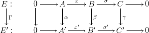

# Extensions of Modules

## Introduction

A long exact sequence of $R$-modules
$$
    0 \lra B_{n-1} \lra \ldots \lra B_{1} \lra B_{0} \lra C \lra 0
$$
running from $A$ to $C$ though $n$ intermediate modules is called an __$n$-fold extension__ of $A$ by $C$. These extensions, suitably classified by a congruence relation, are the elements of a group $\Ext^{\bullet}(C,A)$. To calculate this group, we present $C$ as the quotient $C = F_{0}/S_{0}$ of a free module $F_{0}$; this process can be iterated as $S_{0} = F_{1} / S_{1}$, $S_{1} = F_{2}/S_{2}, \ldots$, to give an exact sequence
$$
    \ldots \lra F_{n} \lra F_{n-1} \lra \ldots \lra F_{1} \lra F_{0} \lra C \lra 0
$$
called a __free resolution__ of $C$. The complex $\Hom(F_{n},A)$ then has cohomology $\Ext^{\bullet}(C,A)$.

## Extensions of Modules

::: definition
Let $A$ and $C$ be modules over a fixed ring $R$. An __extension__ of $A$ by $C$ is a short exact sequence $E : A \into B \onto C$ of $R$-modules and $R$-module homomorphisms. A __morphism__ $\Gamma : E \ra E^{\prime}$ of extensions is a triple $\Gamma = (\alpha, \beta, \gamma)$ of module homomorphisms such that the diagram

is commutative.

In particular, when $A^{\prime} = A$ and $C^{\prime} = C$, then two extensions $E$ and $E^{\prime}$ of $A$ by $C$ are __congruent__ (notation: $E \equiv E^{\prime}$) if there is a morphism $(\id_{A}, \beta, \id_{C}): E \ra E^{\prime}$.
:::

In the case that two extensions are congruent, the short Five Lemma shows that the middle homomorphism $\beta$ is an isomorphism. Thus congruence of extensions is a reflexive, symmetric, and transitive relation.

::: definition
Let $\Ext_{R}(C,A)$ denote the set of all congruence classes of extensions of $A$ by $C$.
:::