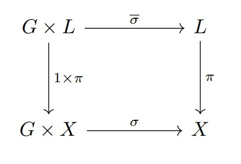

# Geometric Invariant Theory

- See also [algebraic geometry](./algebraic.md).

## Linearisations

##### $G$-linearisation

A _$G$-linearisation_ on a line bundle $L$ is an action $\overline{\sigma}: G \times L \rightarrow L$ such that

- the diagram

commutes;

- the zero section of $L$ is $G$-stable. 
  
##### Picard Groups of Products

Consider two varieties $X, Y$, and their projections $p_{1}: X \times Y \rightarrow X$, $p_{2} : X \times Y \rightarrow Y$. From this we ge a map
$$
p_{1}^{\ast} \times p_{2}^{\ast} : Pic(X) \times Pic(Y) ⟶ Pic(X \times Y),\\ 
(L,M) ⟼ p_{1}^{\ast}(L) \otimes p_{2}^{\ast}(M).
$$
This map $p_{1}^{\ast} \times p_{2}^{\ast}$ is an isomorphism when $X$ and $Y$ are both normal irreducible varieties, and when _one_ of them is _rational_, that is, one contains a non-empty open subset isomorphic to an open subset of some affine space $\mathbb{A}^{n}$.